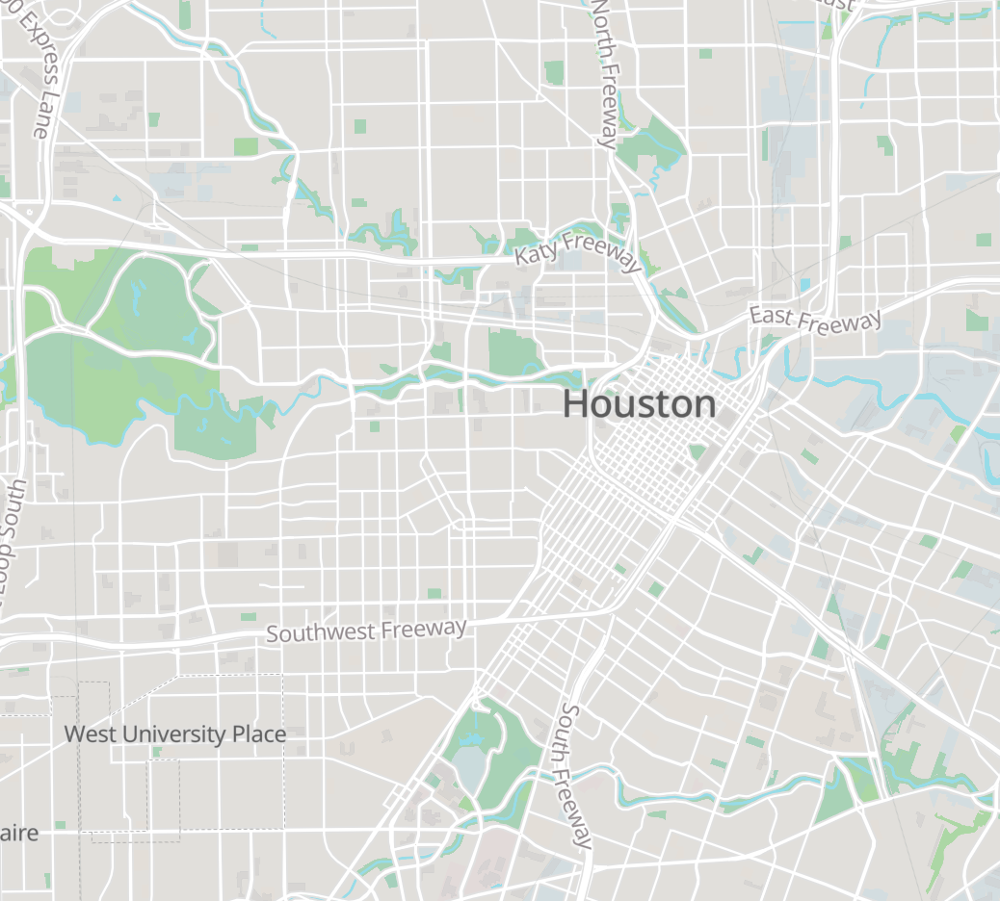

<!-- Coming soon! in the mean time checkout our [web tools](/tools/index.html) and [map tools](/tools/maptools.md) -->

  

    

      
      

        <h5 class="card-title">Web Dev Tools</h5>
        
Tools to URL encode & decode, Base64 encode & decode, hash a string (MD5, SHA-1, SHA-256, SHA-384, SHA-512).

        <a href="/tools" class="btn btn-primary stretched-link">Web Dev Tools</a>
      

    

  

  

    

      
      

        <h5 class="card-title">Mapping Tools</h5>
        
Get the lat/lng of a point, view WKT/GeoJSON features &amp; more. &nbsp;

        <a href="/tools/maptools.html" class="btn btn-primary stretched-link">Web Dev Tools</a>
      

    
 
  

